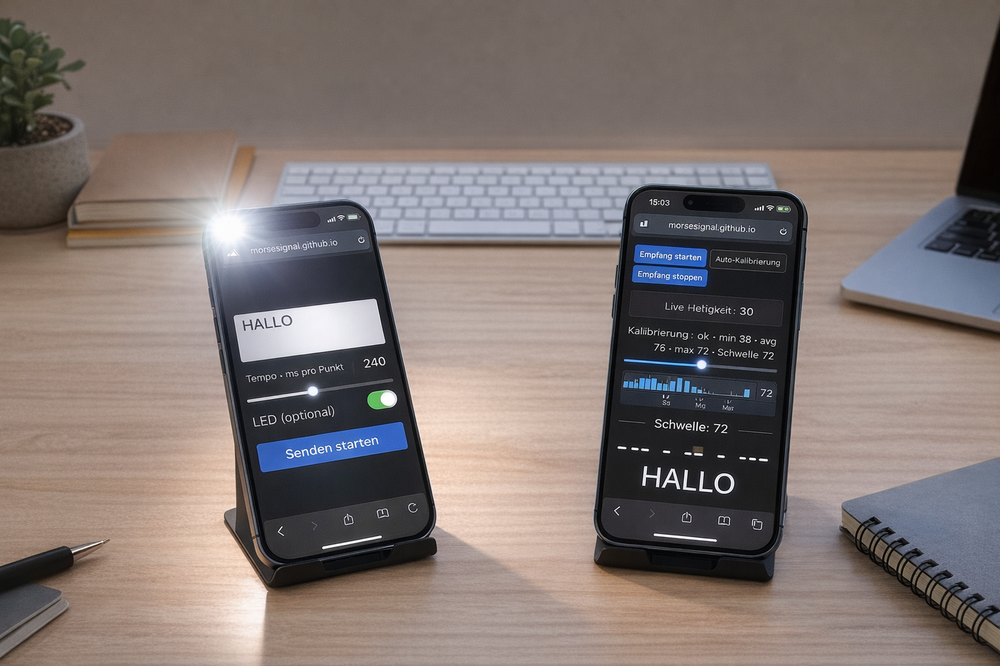
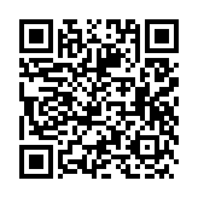

# Morse Light Webapp

Installationsfreie Webapp für iPhone-Morse über Licht: senden per Bildschirm und optional per LED, empfangen per Kamera und live dekodieren.

Mit diesem Setup kann gezeigt werden, was die Unterbrechung des Lichtstrahls in einer Glasfaser für Auswirkungen auf die Datenübertragung hat.

 

 

## Überblick

Diese Webapp ist für zwei iPhones gedacht:

- **Sender-iPhone**: sendet Morsecode als Lichtpulse
- **Empfänger-iPhone**: erkennt die Lichtpulse mit der Kamera und dekodiert sie zu Text

Die App läuft direkt im Browser und muss nicht installiert werden. Nachfolgenden Link auf beiden iPhones öffnen oder QR Code scannen.

https://tbr-brd.github.io/morse-light-webapp/

## Funktionen

- Texteingabe und automatische Umwandlung in Morse
- Senden per **Bildschirmblitz**
- Optionaler Versuch, die **iPhone-LED** im Browser zu schalten
- Empfang per Kamera auf einem zweiten iPhone
- Live-Anzeige von Morsecode und dekodiertem Text
- **Auto-Kalibrierung** des Helligkeits-Schwellwerts

## Wichtiger Hinweis zu iPhones

Die Taschenlampen-/LED-Steuerung im mobilen Browser ist auf iPhones nicht auf jedem Gerät und nicht in jeder Safari-Version zuverlässig verfügbar. Deshalb ist der **Bildschirmblitz** als robuster Fallback eingebaut.

## Dateien im Repository

- `index.html` – die komplette Webapp in einer einzelnen Datei
- `README.md` – diese Anleitung
- `LICENSE` – MIT-Lizenz
- `repo-description.txt` – kurze Beschreibung für GitHub

## Nutzung mit zwei iPhones

## Version mit Auto-Start

- großer Startknopf für den Empfänger
- Kamera startet automatisch
- automatische Kalibrierung direkt nach dem Start
- Messfenster in der Bildmitte
- Fokus auf dekodierten Text

## Testablauf

1. Empfänger: **Empfang automatisch starten**
2. Warten bis **Bereit zum Empfangen**
3. Sender: Nachricht senden
4. Licht im grünen Messfenster halten

## Fehlerbehebung

### Kamera funktioniert nicht
- Prüfen, ob die Seite über **HTTPS** geöffnet wurde
- Kamera-Berechtigung in Safari erlauben
- Seite neu laden

### LED funktioniert nicht
- Das ist auf iPhones im Browser nicht immer unterstützt
- In diesem Fall den **Bildschirmblitz** verwenden

### Dekodierung ist unzuverlässig
- Tempo langsamer stellen
- Dunklere Umgebung wählen
- Kamera besser auf den Sender ausrichten
- Auto-Kalibrierung erneut ausführen
- Schwellwert manuell nachjustieren

## Alternative zu GitHub Pages

Die Datei kann auch direkt bei **Vercel** gehostet werden. Da alles in einer einzelnen HTML-Datei steckt, ist kein Build-Prozess nötig.

## GitHub-Kurzbeschreibung

Der Inhalt aus `repo-description.txt` kann in GitHub als Repository-Beschreibung verwendet werden.
